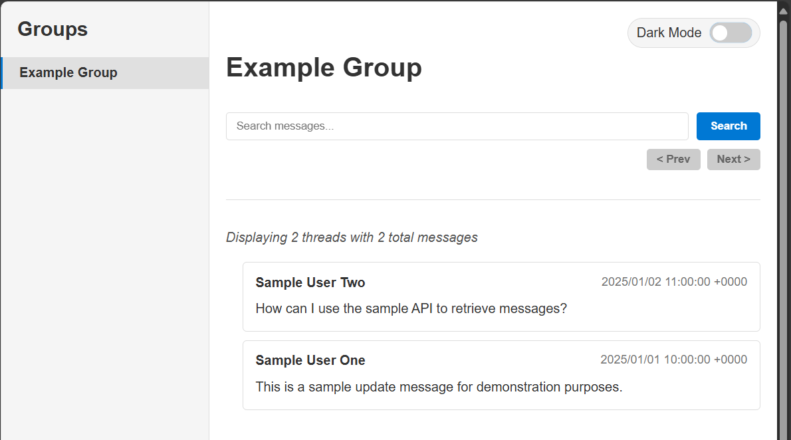

# Yammer Archiver

This is a prototype for archiving Yammer/Viva Engage messages in a group.

It uses the Microsoft Power Automate connector for Viva Engage and its [Get messages in a group (V3)](https://learn.microsoft.com/en-us/connectors/yammer/#get-messages-in-a-group-(v3)) action to retrieve messages from a specified group. The resulting data can be downloaded as JSON files and viewed with the `Dynamics 365 and Power Platform Preview Programs.html` file.

The prototype is based on the article [How to get all messages in a Yammer group using Microsoft Flow](https://alextofan.com/2019/03/18/how-to-get-all-messages-in-a-yammer-group-using-microsoft-flow/).

## Usage

There are three different Power Automate flows:

- [YammerGetGroupMessagesAndReferences](Power%20Automate%20Flow/YammerGetGroupMessagesAndReferences_20250614103541.zip): Retrieves all messages from a specified group. This flow is the easiest to set up and use.
- [YammerGetGroupMessagesAndReferencesWithDelta](Power%20Automate%20Flow/YammerGetGroupMessagesAndReferencesWithDelta_20250622111937.zip): Retrieves all messages from a specified group and uses the delta query to get only new messages since the last run. This flow is more complex but allows for incremental updates.
- [YammerGetGroupsMessagesAndReferencesWithDeltas](Power%20Automate%20Flow/YammerGetGroupsMessagesAndReferencesWithDeltas_20250622111937.zip): Retrieves all messages from a list of groups and uses the delta query to get only new messages for each group since the last run. This flow is the most complex and allows for archiving multiple groups. It also saves the messages in a OneDrive folder structure based on the group names.

### YammerGetGroupMessagesAndReferences

1. Use the [Import Package (Legacy)](https://learn.microsoft.com/en-us/power-automate/export-import-flow-non-solution#import-a-flow) feature in Power Automate to import the zip file in the Power Automate Flow folder. During the import, you will be asked to authenticate with Yammer to set up the Viva Engage connection.
2. Edit the flow to change the Yammer network you want to use. Find the "Get messages in a group (V3)" step and change the "Network ID" field. It should offer a lookup selection of the networks the Viva Engage connection has access to.
3. Save the flow and run it. You will be prompted to provide the group ID of the group you want to archive.
4. Get the feed ID of the group you want to archive. You can find this in the URL of the group page in Yammer/Viva Engage.
5. Run the flow and provide the feed ID as group id when prompted.
6. After the flow has finished, open the run and expand the "Set variable varAllMessages as output" step.
7. In the "Outputs" section, click the "Click to download" link to download the JSON file containing the messages.
8. Save the file in a new folder with the group name as the folder name next to the `Example group` folder. The file name should be the group name followed by `Messages`. See the sample file in the `Example group` folder.
9. Do steps 4-6 for the "Set variable varAllReferences as output" step and add the word `References` to the file name.
10. Add an entry in the `groups-config.json` file for the group. The group name should be the same as the folder name you created in step 8. The entry should look like this:

```json
{
  "groupName": "Example group",
  "groupId": "1234567890",
  "lastMessageId": "0"
}
```
11. Open the `Dynamics 365 and Power Platform Preview Programs.html` file with a http server (e.g. using the Visual Studio Code [Live Server](https://marketplace.visualstudio.com/items?itemName=ritwickdey.LiveServer) extension).



The other flows have similar setups, so only the differences are described here.

### YammerGetGroupMessagesAndReferencesWithDelta

This works like the previous flow, but has the id of the last message as an additional input. Enter 0 to get all messages, or the id of the last message from the previous run to get only new messages since then.

### YammerGetGroupsMessagesAndReferencesWithDeltas

This flow is similar to the previous one, but it works with multiple groups. You need to provide a JSON array with the group names, IDs and the last message IDs for each group. The flow will then retrieve new messages for each group since the last run. The messages and references are saved in a OneDrive folder structure based on the group names. The folder structure is created if it does not exist.

During import of this flow, you will be asked to authenticate with OneDrive to set up the OneDrive connection.

The schema for the JSON array is the same as for the `groups-config.json` file.

```json
[
  {
    "groupName": "Example group",
    "groupId": "12345",
    "lastMessageId": "67890"
  },
  {
    "groupName": "Another group",
    "groupId": "987654321",
    "lastMessageId": "0"
  }
]
```

The files stored in OneDrive will have the same naming convention as described in the previous flows, with the group name followed by `Messages` or `References`. In addition, the `lastMessageId` from the JSON array is included at the end of the file name.

To use those files in the `Dynamics 365 and Power Platform Preview Programs.html` file, you need to copy the files from OneDrive to the group folders next to the `Example group` folder. They need to be merged with any existing files or transformed in case no files from previous runs exist. This is done with the [Merge-GroupJsonFiles.ps1](Merge-GroupJsonFiles.ps1) PowerShell script. 

After the merge, the [Update-LatestMessageId.ps1](Update-LatestMessageId.ps1) PowerShell script can be used to update the `lastMessageId` in the `groups-config.json` file.